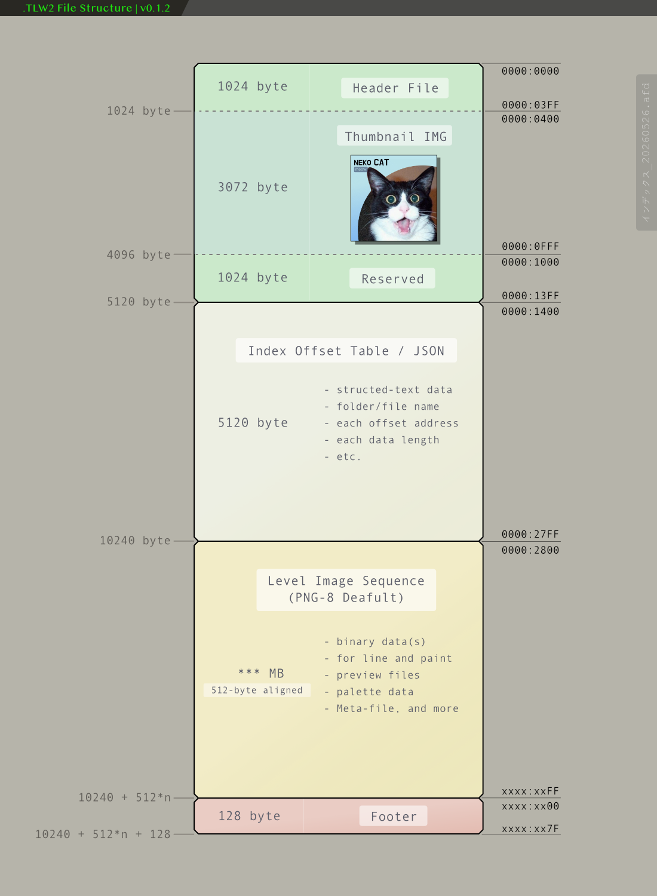

# so simple: `.tlw2` offset address diagram

wip rn. thx.

<div align="center">

</div>  

.  

```
struct TLW2_Header {
                               // #### fixed 128byte ####
    char     magic[16];        // TLW2_JMP_FOOTER\0, TLW2_JMP_INDEX\0\0
    uint32_t format_version;   // 4B
    uint32_t flags;            // 4B
    uint64_t total_size;       // 8B
    uint64_t json_offset;      // 8B
    uint64_t json_size;        // 8B
    uint64_t checksum;         // xxHash64, target: index-table-JSON only
    int64_t  creation_time;    // APFS compatible, nanoseconds since 1970 UTC
    char     comment[64];      // comment, UTF-8

                               // *** free 896byte ***
    uint8_t  reserved[1024 - 128];
};
```

```
struct TLW2_Footer {
                               // *** fixed 128byte ***
    char     magic[16];        // TLW2_DEV_202605\0, TLW2_REL_202701\0
    uint32_t format_version;   // 4B
    uint32_t flags;            // 4B
    uint64_t total_size;       // 8B
    uint64_t json_offset;      // 8B
    uint64_t json_size;        // 8B
    uint64_t checksum;         // xxHash64, target: index-table-JSON only
    int64_t  creation_time;    // APFS compatible, nanoseconds since 1970 UTC
    char     comment[64];      // comment, UTF-8
};
```

.  

## Reference: 128-byte Header Hex Dump Example 

Below is an example of the first 128 bytes (core area) of the `TLW2_Header` struct, pre-packed in Little-Endian format. This demonstrates the `TLW2_JMP_INDEX` mode where the parser can instantly skip header analysis and jump directly to the JSON metadata.

```text
0000:  54 4C 57 32 5F 4A 4D 50  5F 49 4E 44 45 58 00 00  ; char magic[16] ("TLW2_JMP_INDEX\0\0")
0010:  01 00 00 00  00 00 00 00                          ; uint32_t format_version (1), flags (0)
0018:  04 28 00 00 00 00 00 00                          ; uint64_t total_size (10244 bytes -> 0x2804)
0020:  00 14 00 00 00 00 00 00                          ; uint64_t json_offset (5120 -> 0x1400)
0028:  00 14 00 00 00 00 00 00                          ; uint64_t json_size (5120 -> 0x1400)
0030:  00 00 00 00 00 00 00 00                          ; uint64_t checksum (0, unimplemented)
0038:  00 0A 7C A4 9C 2A B3 18                          ; int64_t creation_time (APFS-compat nanoseconds)
0040:  57 49 50 20 74 6C 77 32  20 66 69 6C 65 00 00 00  ; char comment[64] ("WIP tlw2 file"...)
0050:  00 00 00 00 00 00 00 00  00 00 00 00 00 00 00 00  ; (comment padding)
0060:  00 00 00 00 00 00 00 00  00 00 00 00 00 00 00 00  ; (comment padding)
0070:  00 00 00 00 00 00 00 00  00 00 00 00 00 00 00 00  ; (comment padding)
```


🐾
---
